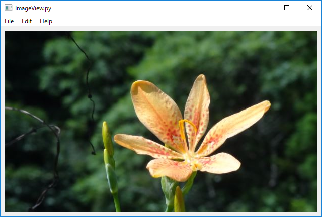
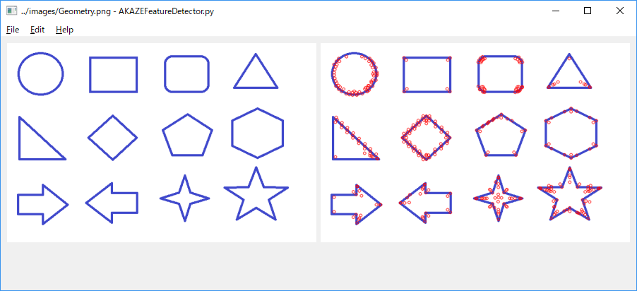
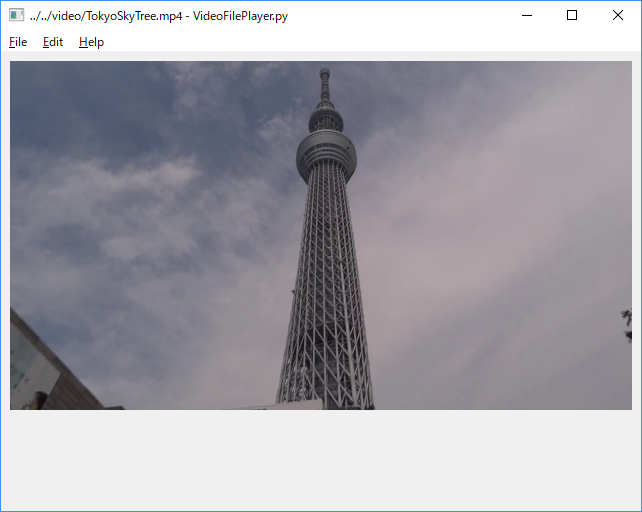
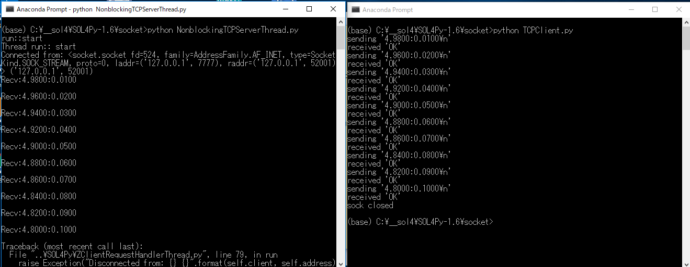
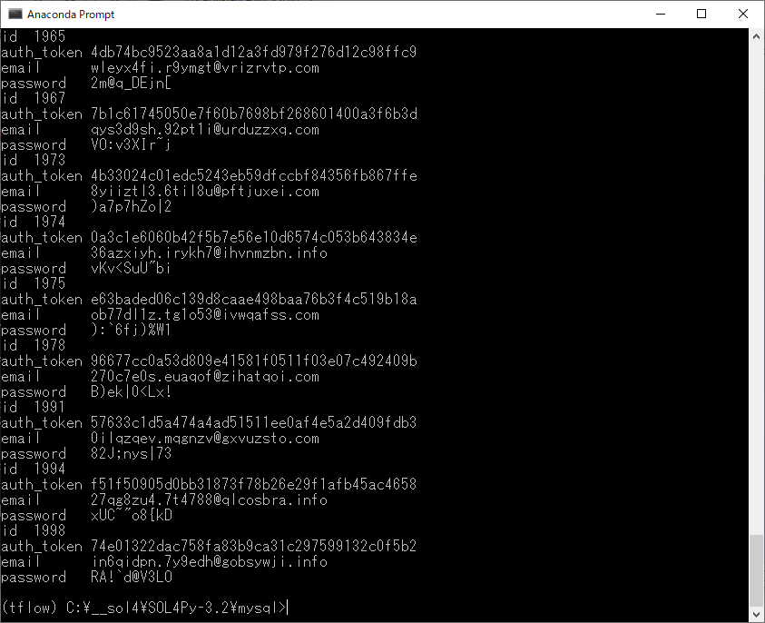

<h2>SOL4Py-V4 (Updated: 2022/06/08)</h2>

<b>
1 What is SOL4Py  
</b>

<b>1.1 SOL4Py</b>
 
SOL4Py is a tiny Python class library for Python, PyQt, OpenCV, and ML.  
The basic class design of SOL4Py is based on that of our <a href="http://www.antillia.com/sol9.2.0/library.html">SOL9 C++ library</a>.  
 In order to develop our library, we have used the latest Python3.8, Tensorflow 2.7.0, torch 1.10, PyQt5, and OpenCV-4.5 on Windows 10 Version 20H2.
We have tested the sample programs on Windows 10 only, but you may run them on Linux environment too, provided you install required Python, 
PyQt, OpenCV modules on Linux.  
 
<li>
2022/06/08: We have created <a href="./SOL4Py-4.0.0-py3-none-any.whl/">a SOL4Py package(SOL4Py-4.0.0-py3-none-any.wh)</a>,
please down load <a href="./SOL4Py-4_Installer.zip">SOL4Py-4_Installer.zip</a> to install the package.
</li>
 
We created a virtual environment <b>py38</b> to 
develop SOL4Py library.
 
 
<table style="border: 1px solid red;">

<tr><td>

; 20220606 Modified to use python 3.8, tensorflow 2.7.0 and torch 1.10.1. 
; Create a virtual env py38 
<pre>
python -m venv c:\py38
cd py38
scripts/activate
pip install -r requirements.txt
</pre>

</table>
 

<b>Freeglut</b> 

 
Please download <a href="http://freeglut.sourceforge.net/">freeglut-2.8.1</a>, and build freeglut.dll from 
the solution file in: 
<pre>
C:\freeglut-2.8.1\VisualStudio\2012\freeglut.sln
</pre>
You may also download the precompiled <a href="https://github.com/martian-antillia/freeglut-2.8.1/blob/main/lib.zip">lib.zip(freeglut.dll freeglut.lib)</a> built by <a href="https://visualstudio.microsoft.com/ja/downloads/">Visual Studio 2022</a>.

 
Copy <b>C:\freeglut-2.8.1\lib\x64\freeglut.dll</b> under <b>C:\Windows\system32.</b>
 

You have to modify <b>win32.py</b> file in <b>C:\py38\Lib\site-packages\OpenGL\platform</b> in the following way. 
<pre>
   @baseplatform.lazy_property
    def GLUT( self ):
        #for possible in ('freeglut%s.%s'%(size,vc,),  'glut%s.%s'%(size,vc,)):
        for possible in ('freeglut%s.%s'%(size,vc,), 'freeglut', 'glut%s.%s'%(size,vc,)):
</pre>

<b>Crypto classes</b> 
We have implemented some wrapper classes to Cipher classes(AES and ChaCha20) of <a href="https://pycryptodome.readthedocs.io/en/latest/">pycrytodome</a> package. 
 
<b>Generator classes</b> 
We have implemented some generator classes(ZEmailAddressGenerator, ZPasswordGenerator and ZTokenGenerator), 
By using those classes, you can generate a lot of fake personal data (personally identifiable information (PII)).
 
 
<b>MySQLDB classes</b> 
We have implemented some wrapper classes to MySQL(ZMySQLDB, ZThreadedMySQLConnection) based on mysql-connector-python.

 

 
</b>

<b>1.2 Ubuntu 20.04LTS</b>
 
 In Ubuntu 20.04LTS environment, you have to run the following commands. 
<pre>
$ sudo apt install x11-apps
$ sudo apt install libgl1-mesa-dev xorg-dev
$ sudo apt install libopencv-dev python3-opencv
$ sudo apt install freeglut3 freeglut3-dev libglew-dev
$ sudo apt install qtbase5-dev qttools5-dev-tools qt5-default
$ pip install -r requirements.txt
$ pip install opencv-contrib-python-headless
</pre>
If you would like to run GUI applications (Qt5, OpenCV and OpenGL) of sol4py on Windows10/wsl2,
you have to install X-Server on Windows10. 
<a href="https://sourceforge.net/projects/vcxsrv">VcXsrv Windows X Server</a>
  
OpenGL example on Ubuntu 20.04LTS of Windows11/wsl2   

 

 
 
<b>
2.1 Basic User Interface
</b>

 
 

<a href="#2.1.1">2.1.1 How to use ZApplicationView?</a>  
<a href="#2.1.2">2.1.2 How to use ZImageView?</a>  
<a href="#2.1.3">2.1.3 How to use ZLabeledComboBox?</a>  
<a href="#2.1.4">2.1.4 How to use ZLabeledSlider?</a>  
<a href="#2.1.5">2.1.5 How to use ZScrolledImageView?</a>  
<a href="#2.1.6">2.1.6 How to use ZColorPositioner?</a>  
<a href="#2.1.7">2.1.7 How to use FolderBrowser?</a>  
<a href="#2.1.8">2.1.8 How to use TabbedWindow?</a>  
 <b>2.2 OpenCV</b>  
<a href="#2.2.1">2.2.1 How to use ZOpenCVImageView?</a>  
<a href="#2.2.2">2.2.2 How to use cv2.boxFilter?</a>  
<a href="#2.2.3">2.2.3 How to use cv2.adaptiveThreshold?</a>  

<a href="#2.2.4">2.2.4 How to use cv2.AKAZE feature detector?</a>  
<a href="#2.2.5">2.2.5 How to use cv2.createStitcher? Fixed bug in OpenCV-4.2.0</a>  
<a href="#2.2.6">2.2.6 How to use cv2.GaussianBlur and cv2.addWeighted?</a>  
<a href="#2.2.7">2.2.7 How to use cv2.getStructuringElement and cv2.morphologyEx?</a>  
<a href="#2.2.8">2.2.8 How to use cv2.FlannBasedMatcher?</a>  
<a href="#2.2.9">2.2.9 How to use cv2.edgePreservingFilter, cv2.detailEnhance and cv2.pencilSketch?</a>  
<a href="#2.2.10">2.2.10 How to use cv2.CascadeClassifier to detect faces?</a>  
<a href="#2.2.11">2.2.11 How to use cv2.HOGDescriptor to detect pedestrians?</a>  
<a href="#2.2.12">2.2.12 How to use cv2.VideoCapture to display video files?</a>  
<a href="#2.2.13">2.2.13 How to use a scrolled plotting area to draw a figure of matplotlib and seaborn?</a>  
<a href="#2.2.14">2.2.14 How to inject the Gaussian noise to an image of OpenCV?</a>  
 
 <b>2.3 Keras CNN</b>  
<a href="#2.3.1">2.3.1 How to use CIFAR-10 and CIFAR-100 datasets on cnn model for image classification?</a>  
<a href="#2.3.2">2.3.2 How to use MNIST and FashionMNIS datasets on cnn model for image classification?</a>  
<a href="#2.3.2">2.3.2 How to use VGG16 cnn model for image classification?</a>  
<a href="#2.3.2">2.3.2 How to use inception-v3 cnn model for image classification?</a>  
 <b>2.4 ML</b>  

<a href="#2.4.1">2.4.1 How to use DecisionTreeClassifier?</a>  
<a href="#2.4.2">2.4.2 How to use LightGBMClassifiers?</a>  
<a href="#2.4.3">2.4.3 How to use RandomForestRegressor?</a>  
<a href="#2.4.4">2.4.4 How to use XGBClassifier?</a>  
 
 <b>2.5 Socket</b>  

<a href="#2.5.1">2.5.1 How to use CustomThreadedTCPServer?</a>  
<a href="#2.5.2">2.5.2 How to use CustomThreadedUDPServer?</a>  
<a href="#2.5.3">2.5.3 How to use CustomThreadingMixInTCPServer.html?</a>  
<a href="#2.5.4">2.5.4 How to use CustomThreadingMixInUDPServer?</a>  
<a href="#2.5.5">2.5.5 How to use NonblockingTCPServerThread?</a>  
 
 <b>2.6 Oracle12C</b>  

<a href="#2.6.1">2.6.1 How to insert data into a table of Oracle12C?</a>  
<a href="#2.6.2">2.6.2 How to select records from a table of Oracle12C ?</a>  
 
 <b>2.7 OpenGL</b>  

<a href="#2.7.1">2.7.1 How to render a colored pyramid in OpenGL?</a>  
<a href="#2.7.2">2.7.2 How to rotate a cube by timer thread in OpenGL?</a>  
<a href="#2.7.3">2.7.3 How to rotate multiple materialized toruses in OpenGL?</a>  
<a href="#2.7.4">2.7.4 How to rotate a multiple jpg textured cubes in OpenGL?</a>  
<a href="#2.7.5">2.7.5 How to map a texture in OpenGL?</a>  
<a href="#2.7.6">2.7.6 How to rotate a textured sphere in OpenGL?</a>  
<a href="#2.7.7">2.7.7 How to use axis-eye-light-positioner to render a textured sphere in OpenGL?</a>  
<a href="#2.7.8">2.7.8 How to render a buffered colored regular icosahedron in OpenGL?</a>  
<a href="#2.7.9">2.7.9 How to render a cube textured by OpenCV-NonPhotorealistic images in OpenGL?</a>  
<a href="#2.7.10">2.7.10 How to show OpenGLView and OpenCVView on a window in SOL4Py?</a>  
 
 <b>2.8 Keras samples</b>  

<a href="#2.8.1">2.8.1 How to preview images generated by Keras ImageDataGenerator?</a>  
<a href="#2.8.2">2.8.2 How to create an image classifier for your image data by using CNN?</a>  
<a href="#2.8.3">2.8.3 How to visualize training accuracy and loss in Keras Model fitting process by using matplotlib?</a>  
<a href="#2.8.4">2.8.4 How to derive MNISTDenoisingAutoEncoder class from MNISTAutoEndoder?</a>  
<a href="#2.8.5">2.8.5 How to create PictogramClassifier to TOKYO2020-SPORT-PICTOGRAMS by using Keras ImageDataGenerator?</a>  
<a href="#2.8.6">2.8.6 How to apply Keras AutoEncoder to color images of VegeFruits dataset?</a>  
 
 
 
<b>
2.1 Basic Sample Programs
</b>

 

 
<a name="2.1.1"><a href="./uisamples/ApplicationView.py">2.1.1 How to use ZApplicationView?  

</a>
</a>
 
 
 

<a name="2.1.2">
<a href="./uisamples/ImageView.py">2.1.2 How to use ZImageView?  

</a>
</a>
 
 
 

<a name="2.1.3">
<a href="./uisamples/LabeledComboBox.py">2.1.3 How to use ZLabeledComboBox?  

</a>
</a>
 
 
 

<a name="2.1.4">
<a href="./uisamples/LabeledSlider.py">2.1.4 How to use ZLabeledSlider?  

</a>
</a>
 
 
 

<a name="2.1.5">
<a href="./uisamples/ScrolledImageView.py">2.1.5 How to use ZScrolledImageView?</a>  

</a>
</a>
 
 
 
<a name="2.1.6">
<a href="./uisamples/ColorPositioner.py">2.1.6 How to use ZColorPositioner?</a>  

</a>
</a>
 
 
 
 
<a name="2.1.7">
<a href="./uisamples/FolderBrowser.py">2.1.7 How to use FolderBrowser?</a>  

</a>
</a>
 
 
 
 

<a name="2.1.8">
<a href="./uisamples/TabbedWindow.py">2.1.8 How to use TabbedWindow?</a>  

</a>
</a>
 
 
 
 
<a name="2.2.1">
<a href="./opencv/OpenCVImageView.py">2.2.1 How to use ZOpenCVImageView?  

</a>
</a>
 
 
 

<a name="2.2.2">
<a href="./opencv/BoxFilter.py">2.2.2 How to use cv2.boxFilter?  

</a>
</a>
 
 
 

<a name="2.2.3">
<a href="./opencv/AdaptiveImageThresholding.py">2.2.3 How to use cv2.adaptiveThreshold?  

</a>
</a>
 
 
 
<a name="2.2.4">
<a href="./opencv/AKAZEFeatureDetector.py">2.2.4 How to use cv2.AKAZE feature detector?  

</a>
</a>
 
 
 
<a name="2.2.5">
<a href="./opencv/ImageStitcher.py">2.2.5 How to use cv2.createStitcher?  
In OpenCV-4.0.0 and 4.1.0, this sample program didn't work well by a stitcher bug. 
In OpenCV-4.2.0 the bug has been fixed, and this runs well.  

</a>
</a>
 
 
 
<a name="2.2.6">
<a href="./opencv/ImageSharpening.py">2.2.6 How to use cv2.GaussianBlur and cv2.addWeighted?  

</a>
</a>
 
 
 
<a name="2.2.7">
<a href="./opencv/ImageMorphing.py">2.2.7 How to use cv2.getStructuringElement and cv2.morphologyEx?  

</a>
</a>
 
 
 
<a name="2.2.8">
<a href="./opencv/FlannBasedMatcher.py">2.2.8 How to use cv2.FlannBasedMatcher?  

</a>
</a>
 
 
 
<a name="2.2.9">
<a href="./opencv/NonPhotorealisticRendering.py">2.2.9 How to use cv2.edgePreservingFilter, cv2.detailEnhance and cv2.pencilSketch?  

</a>
</a>
 
 
 
<a name="2.2.10">
<a href="./opencv/ObjectDetectorByCacadeClassifier.py">2.2.10 How to use cv2.CascadeClassifier to detect faces?  

</a>
</a>
 
 
 
<a name="2.2.11">
<a href="./opencv/HOGPeopleDetector.py">2.2.11 How to use cv2.HOGDescriptor to detect pedestrians?  

</a>
</a>
 
 
 
<a name="2.2.12">
<a href="./opencv/VideoFilePlayer.py">2.2.12 How to use cv2.VideoCapture to display video files?  

</a>
</a>
 
 
 
<a name="2.2.13">
<a href="./plot/ScrolledPlottingArea.py">2.2.13 How to use a scrolled plotting area to draw a figure of matplotlib and seaborn?  

</a>
</a>
 
 
 
<a name="2.2.14">
<a href="./opencv/ImageGaussianNoiseInjector.py">2.2.14 How to inject the Gaussian noise to an image of OpenCV?  

</a>
</a>
 
 
 
<a name="2.3.1">
<a href="./cnn/CIFAR/CIFARClassifier.py">2.3.1 How to use CIFAR-10 and CIFAR-100 datasets on cnn model for image classification?  

</a>
</a>
 
 
 
<a name="2.3.2">
<a href="./cnn/MNIST/MNISTClassifier.py">2.3.2 How to use MNIST and FashionMNIS datasets on cnn model for image classification?  

</a>
</a>
 
 
 
<a name="2.3.3">
<a href="./cnn/VGG16/VGG16Classifier.py">2.3.3 How to use VGG16 cnn model for image classification?  

</a>
</a>
 
 
 
<a name="2.3.4">
<a href="./cnn/inception-v3/InceptionV3Classifier.py">2.3.4 How to use inception-v3 cnn model for image classification?  

</a>
</a>
 
 
 
<a name="2.4.1">
<a href="./ml/DecisionTreeClassifier.py">2.4.1 How to use DecisionTreeClassifier?  

</a>
</a>
 
 
 
<a name="2.4.2">
<a href="./ml/LightGBMClassifier.py">2.4.2 How to use LightGBMClassifiers?  

</a>
</a>
 
 
 

<a name="2.4.3">
<a href="./ml/RandomForestRegressor.py">2.4.3 How to use RandomForestRegressor?  

</a>
</a>
 
 
 
<a name="2.4.4">
<a href="./ml/XGBClassifier.py">2.4.4 How to use XGBClassifier?  

</a>
</a>
 
 
 
<a name="2.5.1">
<a href="./socket/CustomThreadedTCPServer.py">2.5.1 How to use CustomThreadedTCPServer?  

</a>
</a>
 
 
 
<a name="2.5.2">
<a href="./socket/CustomThreadedUDPServer.py">2.5.2 How to use CustomThreadedUDPServer?</a>  

</a>
</a>
 
 
 
<a name="2.5.3">
<a href="./socket/CustomThreadingMixInTCPServer.py">2.5.3 How to use CustomThreadingMixInTCPServer.py?</a>  

</a>
</a>
 
 
 
<a name="2.5.4">
<a href="./socket/CustomThreadingMixInUDPServer.py">2.5.4 How to use CustomThreadingMixInUDPServer?</a>  

</a>
</a>
 
 
 
<a name="2.5.5">
<a href="./socket/NonblockingTCPServerThread.py">2.5.5 How to use NonblockingTCPServerThread?</a>  

</a>
</a>
 
 
 
<a name="2.6.1">
<a href="./oracle/InsertIntoTable.py">2.6.1 How to insert data into a table of Oracle12C?</a>  
</a>
 
 
 
<a name="2.6.2">
<a href="./oracle/SelectFromTable.py">2.6.2 How to select records from a table of Oracle12C ?</a>  
</a>
 
 
 
<a name="2.7.1">
<a href="./opengl/ColoredPyramid.py">2.7.1 How to render a colored pyramid in OpenGL?  

</a>
</a>
 
 
 
<a name="2.7.2">
<a href="./opengl/CubeRotationByTimerThread.py">2.7.2 How to rotate a cube by timer thread in OpenGL?  

</a>
</a>
 
 
 
<a name="2.7.3">
<a href="./opengl/MaterializedTorusesRotationByKeyInput.py">2.7.3 How to rotate multiple materialized toruses in OpenGL?  

</a>
</a>
 
 
 
<a name="2.7.4">
<a href="./opengl/MultiJPGTexturedCubeRotationByKeyInput.py">2.7.4 How to rotate a multiple jpg textured cubes in OpenGL?  

</a>
</a>
 
 
 
<a name="2.7.5">
<a href="./opengl/Texture.py">2.7.5 How to map a texture in OpenGL?  

</a>
</a>
 
 
 
<a name="2.7.6">
<a href="./opengl/TexturedSphereRotationByKeyInput.py">2.7.6 How to rotate a textured sphere in OpenGL?  

</a>
</a>
 
 
 
<a name="2.7.7">
<a href="./opengl/TexturedSphereWithAxisEyeAndLightPositioner.py">2.7.7 How to use axis-eye-light-positioner to render a textured sphere in OpenGL?  

</a>
 
 
 
 
<a name="2.7.8">
<a href="./opengl/BufferedColoredRegularIcosahedron.py">2.7.8 How to render a buffered colored regular icosahedron in OpenGL?  

</a>
</a>
 
 
 
<a name="2.7.9">
<a href="./openglcv/NonPhotorealisticImagesTexturedCube.py">2.7.9 How to render a cube textured by OpenCV-NonPhotorealistic images in OpenGL?  

</a>
</a>
 
 
 
<a name="2.7.10">
<a href="./openglcv/OpenGLCVImageViews.py">2.7.10 How to show OpenGLView and OpenCVView on a window in SOL4Py?  

</a>
</a>
 
 
 
<a name="2.8.1">

<a href="./keras/AugmentedImagePreview.py">2.8.1 How to preview images generated by Keras ImageDataGenerator?  

</b>
</a>
</a>
 
 
 
<a name="2.8.2">
<a href="./cnn/VegeFruits/VegeFruitsClassifier.py">2.8.2 How to create an image classifier for your image data by using CNN?  
  
  

</b>
</a>
</a>
 
 
 
<a name="2.8.3">
<a href="./cnn/TrainingProcessMonitor.py">2.8.3 How to visualize training accuracy and loss in Keras Model fitting process by using matplotlib?  

</b>
</a>
</a>
 
 
 
 
<a name="2.8.4">
<a href="./cnn/MNISTDenoisingAutoEncoder/MNISTDenoisingAutoEncoder.py">2.8.4 How to derive MNISTDenoisingAutoEncoder class from MNISTAutoEndoder?  

</b>
</a>
</a>
 
 
 
<a name="2.8.5">
<a href="./cnn/TOKYO2020_SPORT_PICTOGRAMS/TOKYO2020_SPORT_PICTOGRAMS_Classifier.py">2.8.5 How to create PictogramClassifier to TOKYO2020-SPORT-PICTOGRAMS by using Keras ImageDataGenerator?  
  
  
</b>
</a>
</a>
 
 
 

<a name="2.8.6">
<a href="./cnn/VegeFruitsAutoEncoder/VegeFruitsAutoEncoder.py">2.8.6 How to apply Keras AutoEncoder to color images of VegeFruits dataset?  
  

</b>
</a>
</a>
 
 
 
<!--
<a name="3.1.1">
<a href="./keras-yolo3/YoloObjectDetector.py">3.1.1 How to use yolo3 in Keras to detect objects in an image?  

</b>
</a>
</a>
 
 
 
<a name="3.1.2">
<a href="./keras-yolo3/CustomYoloObjectDetector.py">3.1.2 How to derive CustomYoloObjectDetector class from YOLO class to display detailed information detected ?  
  

</b>
</a>
</a>
 
-->

 
 
<a name="3.2.1">
<a href="./cnn/RoadSigns/RoadSignsClassifier.py">3.2.1 How to create RoadSignsClassifier to classify the roadsigns in an image by using Keras ImageDataGenerator?  
  
  

</b>
</a>
</a>
 
 
 
<a name="3.2.2">
<a href="./torch-cnn/RoadSigns/TorchRoadSignsClassifier.py">3.2.2 How to create TorchRoadSignsClassifier to classify the roadsigns in an image by using ZImageDataGenerator and TorchRoadSignsDataset?  
  
  

</b>
</a>
</a>
 
 
 

<a name="4.1">

<a href="./samples/FileTreeWalker.py">4.1 How to create LogWriter(ZLogger) class to write a string of format
of [datetime, log-level, filename, line-no, function, message] to multiple streams?  

</b>
</a>
</a>
 
 
 
<a name="5.1">

<a href="./torch-cnn/Inception-v3/TorchInceptionV3Classifier.py">5.1 How to create TorchInceptionV3Classifier to use pretrained torch inceptionv3 model?  
  
  
</b>
</a>
</a>
 
 
 
<a name="5.2">

<a href="./torch-cnn/CIFAR/TorchCIFARModel.py">5.2 How to visualize training accuracy and loss in Torch Model fitting process by using matplotlib and tqdm(progress bar)?  
  
  

</b>
</a>
</a>
 
 
 
<a name="5.3">
<a href="./torch-cnn/MNIST/TorchMNISTClassifier.py">5.3 How to create TorchMNISTClassifier by using ZTorchMNISTModel?  
  
  
</b>
</a>
</a>
 
 
 
<a name="5.4">
<a href="./torch-cnn/CIFAR/TorchCIFARClassifier.py">5.4 How to create TorchCIFARClassifier by using TorchCIFARModel?  
  
  
</b>
</a>
</a>
 
 
<a name="5.5">
<a href="./torch-cnn/TOKYO2020_SPORT_PICTOGRAMS/Torch_TOKYO2020_SPORT_PICTOGRAMS_Classifier.py">5.5 How to create TorchPictogramClassifier to TOKYO2020-SPORT-PICTOGRAMS by using ZImageDataGenerator and Torch_TOKYO2020_SPORT_PICTOGRAMS_Dataset?  

  
  
</b>
</a>
</a>
 
 
<a name="5.6">
<a href="./torch-cnn/VegeFruitsDenoisingAutoEncoder/TorchVegeFruitsDenoisingAutoEncoder.py">5.6 How to create ZPILGaussianNoise and insert it into Torch image transforms Composer?  
  
</b>
</a>
</a>
 
 
 
<a name="6.1">
<a href="./SOL4Py/ZCustomImageDataGenerator.py">6.1 How to create ZCustomImageDataGenerator by using Pillow image library?  
  
<!--
  
-->
</b>
</a>
</a>
 
 

<a name="6.2">

<a href="./utils/CustomAugmentedImagePreview/CustomAugmentedImagePreview.py">6.2 How to preview images augmented by ZCustomImageDataGenerator?  
  
  
</b>
</a>
</a>
 
 
<a name="6.3">
<a href="./utils/CustomImageDataGenerator/CustomImageDataGenerator.py">6.3 How to generate and save images generated by ZCustomImageDataGenerator?  
  
  

<!--
  
-->
</b>
</a>
</a>

<!-- 2020/01/27 -->

<a name="7.1">
<a href="./crypto/AESCipher.py">7.1 How to encrypt and decrypt strings by using ZAESCipher?  
  
</b>
</a>
</a>
 
 

<a name="7.2">

<a href="./crypto/AESIVEmbeddedCipher.py">7.2 How to encrypt and decrypt files by using ZAESIVEmbedeCipher?  
  
</b>
</a>
</a>
 
 
<a name="7.3">
<a href="./crypto/ChaCha20Cipher.py">7.3 How to encrypt and decrypt strings by using ZChaCha20Ciper?  
  
</b>
</a>
</a>

 
 
<a name="7.4">
<a href="./crypto/ChaCha20NonceEmbeddedCipher.py">7.4 How to encrypt and decrypt strings by using ZChaCha20NonceEmbeddeCiper?  
  
</b>
</a>
</a>
<!-- 2020/01/28 -->

<a name="8.1">
<a href="./mysql/EncryptDecryptPassword.py">8.1 8.1 How to encrypt and decrypt a password in a MySQL table by using ZAESIVEmbeddedCipher?  
  
</b>
</a>
</a>
 
 

<a name="8.2">

<a href="./mysql/SelectFromTableThread.py">8.2 8.2 How to use ZThreadedMySQLConnection in in MySQL??  
  
</b>
</a>
</a>
 
